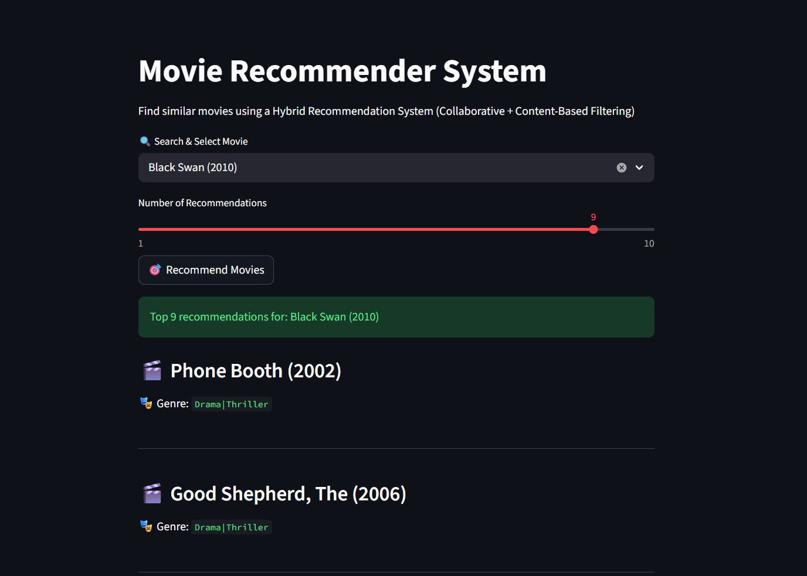

# 🎬 Hybrid Movie Recommender System

A **Hybrid Movie Recommendation System** that combines **Content-Based Filtering** and **Collaborative Filtering** using Machine Learning techniques, deployed with a Streamlit web interface.

---

## 📸 UI Preview

### 🔍 Movie Search & Recommendation Interface

---

## 🧠 How It Works

This system is a **Hybrid Recommendation Engine** that uses two complementary approaches to improve recommendation quality.

---

### 🎯 1. Content-Based Filtering

This method recommends movies based on their **features (genres)**.

#### 📌 Process:
- Movies are represented using their genres
- Genres are converted into numerical vectors
- Similarity between movies is calculated using **Cosine Similarity**
- Movies with highest similarity scores are recommended

#### 📌 Intuition:
> If you like a movie, you will likely enjoy similar movies with the same characteristics.

---

### 👥 2. Collaborative Filtering

This method recommends movies based on **user behavior patterns**.

#### 📌 Process:
- Uses user rating history from dataset
- Builds a **user-item interaction matrix**
- Finds users with similar taste patterns
- Recommends movies liked by similar users

#### 📌 Intuition:
> Users with similar preferences in the past will likely agree in the future.

---

### ⚡ 3. Hybrid Model

To improve recommendation accuracy, both methods are combined.

#### 📌 Formula:

Final Score = (Content-Based Score + Collaborative Score) / 2

#### 📌 Why Hybrid?
- Content-Based → solves item similarity
- Collaborative → captures user behavior
- Hybrid → balances both approaches and improves accuracy

---

## 📂 Dataset

This project uses the **MovieLens dataset**, a widely used benchmark in recommendation systems research.

### 📁 Files:
- `movies.csv` → movie metadata (title, genres)
- `ratings.csv` → user ratings data

### 📌 Source:
https://grouplens.org/datasets/movielens/

---

## 🧰 Tech Stack

- 🐍 Python
- 📊 Pandas
- 🔢 NumPy
- 🤖 Scikit-learn
- 🎛️ Streamlit

---

## 📊 Machine Learning Concepts

This project implements:

- Feature Engineering (Genre Encoding)
- Cosine Similarity
- User-Item Matrix
- Collaborative Filtering
- Hybrid Recommendation Systems

---
rname/movie-recommender.git
cd movie-recommender
